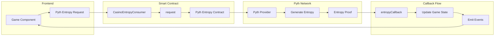
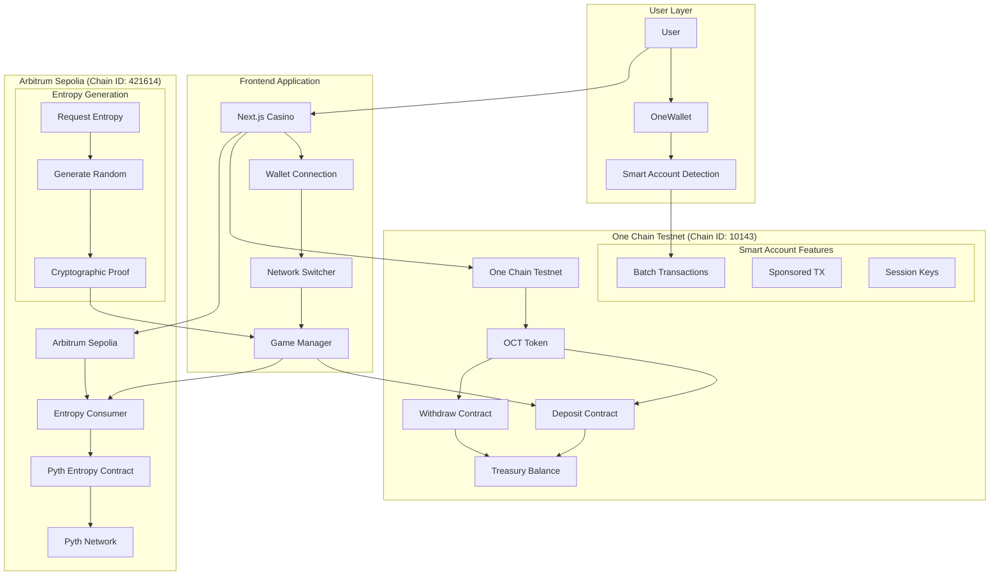
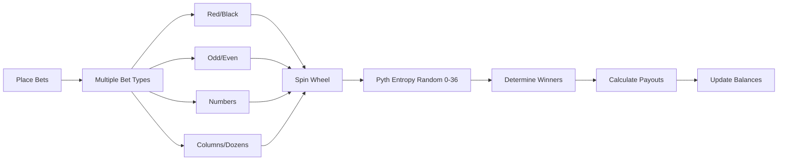
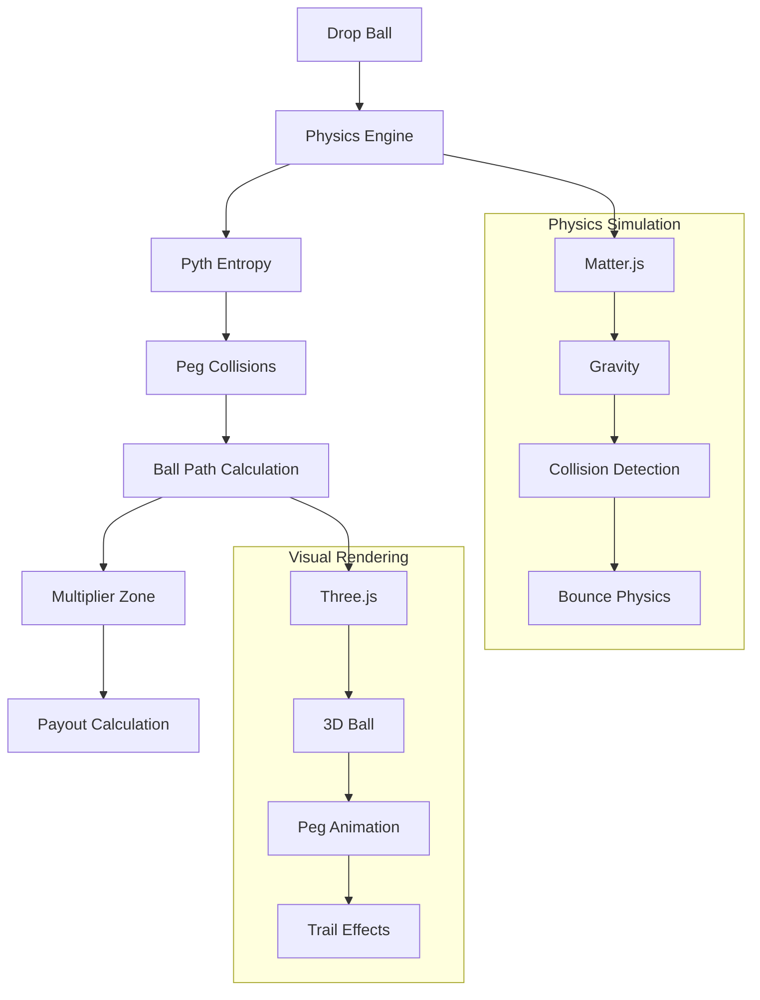
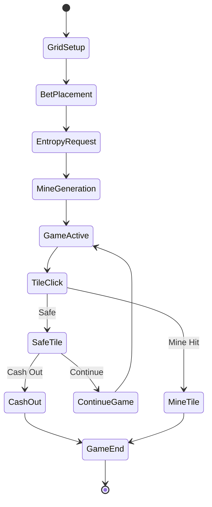
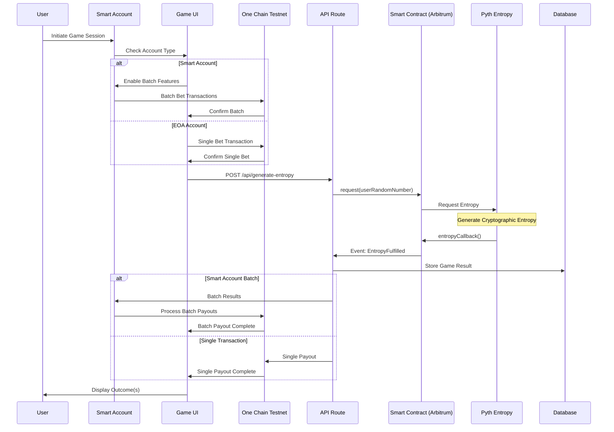
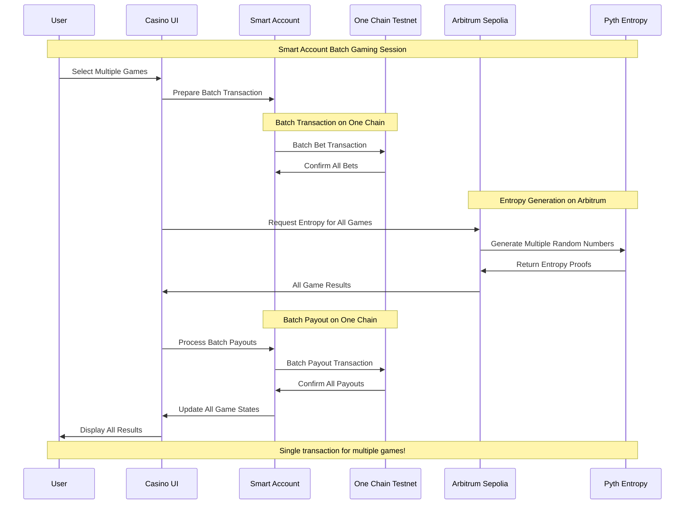

# OneArcade

A decentralized casino platform built on One Chain Testnet with Pyth Entropy for provably fair gaming and MetaMask Smart Accounts integration.

## Inspiration: 
A few days ago, I was exploring transactions on Etherscan when I saw an advertisement for a popular casino platform (stake.com) offering a 200% bonus on first deposit. I deposited 120 USDT and received 360 USDT in total balance in their custodial wallet.

When I started playing, I discovered I could only bet $1 per game and couldn't increase the amount. After contacting customer support, I learned I had been trapped by hidden "wager limits" tied to the bonus scheme. To withdraw my original deposit, I would need to play $12,300 worth of games!

In a desperate attempt to recover my funds, I played different games all night - roulette, mines, spin wheel... and lost everything.

This frustrating experience inspired OneArcade: a combination of GameFi, AI, and DeFi where users can gamble casino games in a safe, secure, and 100% transparent environment where every bet is verifiably fair by the user itself and no centralized authority manipulates game outcomes.


## 🎯 The Problem

The traditional online gambling industry suffers from several issues:

- **Unfair Game Outcomes**: 99% of platforms manipulate game results, leading to unfair play
- **High Fees**: Exorbitant charges for deposits, withdrawals, and gameplay
- **Restrictive Withdrawal Policies**: Conditions that prevent users from accessing their funds
- **Misleading Bonus Schemes**: Trapping users with unrealistic wagering requirements
- **Lack of True Asset Ownership**: Centralized control over user funds
- **User Adoption Barriers**: Complexity of using wallets creates friction for web2 users
- **No Social Layer**: Lack of live streaming, community chat, and collaborative experiences

## 💡 Our Solution

OneArcade addresses these problems by offering:

- **Provably Fair Gaming**: Powered by Pyth Entropy


- **Multiple Games**: Wheel, Roulette, Plinko, and Mines with verifiable outcomes
- **Flexible Withdrawal**: Unrestricted access to funds
- **Transparent Bonuses**: Clear terms without hidden traps
- **True Asset Ownership**: Decentralized asset management
- **Live Streaming Integration**: Built with Livepeer, enabling real-time game streams and tournaments
- **On-Chain Chat**: Supabase + Socket.IO with wallet-signed messages for verifiable player communication
- **Gasless Gaming Experience**: Treasury-sponsored transactions for seamless web2-like experience

## 🎮 Features


### 1. Provably Fair Gaming


- **Pyth Entropy**: Cryptographically secure randomness
- **On-Chain Verification**: All game outcomes verifiable
- **Transparent Mechanics**: Open-source game logic

#### Pyth Entropy Integration Architecture



### 2. Game Selection

- **Roulette**: European roulette with batch betting
- **Mines**: Strategic mine-sweeping with pattern betting
- **Plinko**: Physics-based ball drop with auto-betting features
- **Wheel**: Classic spinning wheel with multiple risk levels

### 3. Web2 User Experience

- **Gasless Transactions**: Treasury-sponsored transactions eliminate gas fees
- **Seamless Onboarding**: Simplified wallet experience for web2 users
- **Familiar Interface**: Web2-like experience with web3 benefits

- **OCT Token**: Native currency for One Chain Testnet
- **Real-time Gaming**: Instant deposits and withdrawals
- **Advanced Betting**: Batch transactions and automated strategies


## 🏗 System Architecture Overview

### Multi-Network Architecture



## 🎯 Games

### 1. **Wheel of Fortune**
- Classic spinning wheel game
- Multiple risk levels
- Batch betting support

### 2. **Roulette**
- European roulette with single zero
- Multiple betting options
- Smart Account batch bets



### 3. **Plinko**
- Physics-based ball drop game
- Adjustable rows and risk levels
- Auto-betting features



### 4. **Mines**
- Strategic mine-sweeping game
- Customizable mine count
- Progressive betting strategies



## 🛠 Development

### Prerequisites
- Node.js 18+
- MetaMask wallet
- One Chain Testnet OCT tokens

### Installation
```bash
# Clone the repository
git clone https://github.com/your-repo/apt-casino-onechain

# Install dependencies
npm install

# Start development server
npm run dev
```

### Build for Production
```bash
npm run build
npm start
```

### Deploy to One Chain Testnet
```bash
npm run deploy:onechain
```

### Game Execution Flow (Smart Account Enhanced)



### Smart Account Transaction Flow



## 🔗 Links

- **Live Demo**: https://apt-casino-onechain.vercel.app
- **Youtube Demo Link**: https://youtu.be/hVWe3uzHcOA
- **Github Link**: https://github.com/AmaanSayyad/APT-Casino-OneChain 
- **PitchDeck Link:** https://www.figma.com/deck/OXOSAPIzG0CJlKFDSepWZ8/APT-Casino-OneChain?node-id=1-1812&p=f&t=PPd57Zulv2qJt1bZ-1&scaling=min-zoom&content-scaling=fixed&page-id=0%3A1 

## 🔮 Future Roadmap

- **Mainnet Launch**: Deploying on one chain mainnet for real-world use after launch.
- **Additional Games**: Expanding the game selection and build 20+ new games
- **Enhanced DeFi Features**: Staking, farming, yield strategies
- **Developer Platform**: Allowing third-party game development and acting as a game launchpad
- **Advanced Social Features**: Enhanced live streaming and chat capabilities
- **ROI Share Links**: Shareable proof-links for withdrawals that render dynamic cards on social platforms
- **Tournament System**: Competitive gaming with leaderboards and prizes
